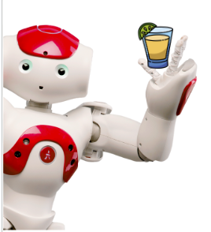
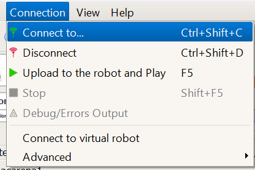
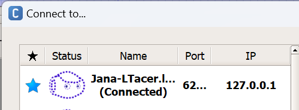

# NAO Challenge 2023

---

###### _Master of Artificial Intelligence - Fundamentals of Artificial Intelligence and Knowledge Representation_

Team: <br/>
Jana Nikolovska [unibo email](jana.nikolovska@studio.unibo.it) 
| [github profile](https://github.com/jananikolovska)<br/>
Carlo Merola [unibo email](carlo.merola@studio.unibo.it) 
| [github profile](https://github.com/carlomerola)<br/>


## TO-DO:
1. ~~Fix order of text boxes~~
2. ~~Add Choreographe made moves to dance_moves folder~~
2. ~~Get the metadata cleaned and final version~~
2. After 2 is done, fix the timings of TEQUILA - TEST IT
3. Make the script runnable on any platform in order to be tested like said in slides. - TEST IT
4. Write the README
5. ~~Add some function explanations to code~~
6. Create a presentation

## ▶️ Run the program
1. Install python2.7
2. Create and activate a virtual environment
```
conda create -y -n guskaNao python=2.7
conda activate guskaNao
```
3. Clone the repository and run the following code in the project directory:
```
pip install -r requirements.txt
```
4. Open Choreoraphe and connect to a virtual robot. Get the IP and PORT values


5. Run the program in command line using the IP and PORT as arguments (see example below 👇)<br/>
_Default values for IP and PORT are specified in the config.ini file_
```
python main.py ip port
```
##### 📌 Example
```
python main.py "127.0.0.1" 53860
```

## 📝 Repository Structure
* __main.py__ - run main program
* __nao.py__ - define classes and search problem
* __utils.py__ - helper functions
* __meta_data__ 
* __dance_moves__
* __aima__ - Code for Artificial Intelligence: A Modern Approach (AIMA) 4th edition by Peter Norvig and Stuart Russel.
* __tequila.mp3__ - music choice
* __requirements.txt__
* __config.ini__

